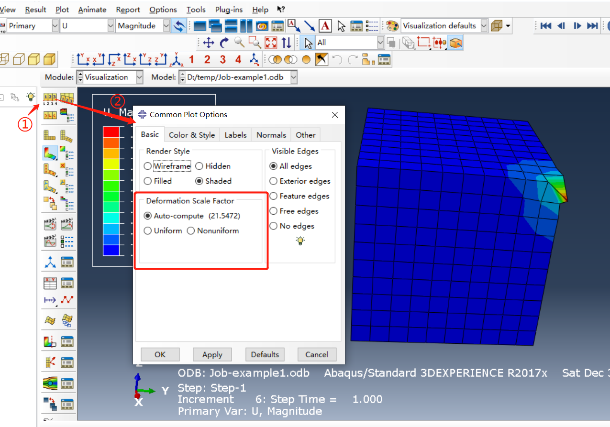

# 有限元模型变形云图的显示

### ABAQUS操作

#### 建立有限元模型

块体模型，底面全约束，施加结点集中力载荷

求解，显示位移云图

#### 设置变形缩放系数

调整变形系数的窗体：

Deformation Scale Factor 就是**变形缩放系数**，几个参数：

- Auto-compute：使用ABAQUS计算得到的变形系数；
- Uniform：使用**自定义**的变形缩放系数绘制变形图；
- Nonuniform：不绘制变形图。

点击Uniform，自定义变形缩放系数：

设置**Value=100**，点击下方的Apply:

设置**Value=10**，点击下方的Apply:

### VTK算法

对于某一**结点**：

- 变形前坐标：(x,y,z)，
- 结点位移（Ux,Uy,Uz），
- 显示时的变形缩放系数（Deformation Scale Factor）：factor

变形后的坐标(**不考虑变形缩放系数**)：`（x+Ux,y+Uy,z+Uz）`;

变形后的坐标(**考虑变形缩放系数**)：`（x+Ux* factor,y+Uy* factor,z+Uz* factor）`;

### ABAQUS与VTK效果对比

#### 默认的变形系数（21.5472）

ABAQUS具体结果

细节：

VTK自己计算的结果

VTK该节点的变形数据：

结论：vtk与ABAQUS计算的变形后坐标一致

#### 变形系数设为100

ABAQUS：

.png)

VTK：

VTK与ABAQUS计算得到的变形后坐标一致

#### 结论

VTK计算变形后节点坐标的算法与ABAQUS一致