## 应力公式

> Copyright: danyh
>
> date: 2023/01/14

资料来源：《材料力学》刘鸿文 第6版

b站课程：[50平面应力状态分析-解析法_哔哩哔哩_bilibili](https://www.bilibili.com/video/BV1tV41187eX/?spm_id_from=pageDriver&vd_source=44547350ad892fe24ff427dc83bf7c27)

[北航力学博后讲透弹性力学4斜截面上的正应力和切应力_哔哩哔哩_bilibili](https://www.bilibili.com/video/BV1YP4y1T7Fj/?spm_id_from=pageDriver&vd_source=44547350ad892fe24ff427dc83bf7c27)

参考文献：[三角函数法](应力空间内主应力及主方向的解析表达式.pdf)

#### 背景知识

##### 平面应力分析

- 研究对象：单元体中某一个方向面上的应力情况

- 主平面：当斜截面的方向为满足$tan2\alpha_0 =\frac{-2\tau_x}{\sigma+x-\sigma_y}$的$\alpha_0$时，此时$\tau_{\alpha_0}=0$且$\frac{d\sigma_{\alpha_0}}{d\alpha}=0$，即改斜截面上的应力$\sigma_\alpha$达到极值且切应力为0

  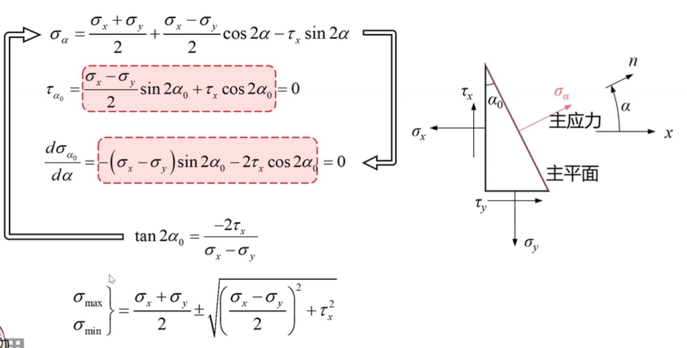

- 主应力：切应力为0的平面成为主平面，主平面上的正应力成为主应力。在上图中把求出的$\alpha$带入原式中求出的$\sigma_{max}/\sigma_{min}$就是主应力

- 应力圆：将右下角的两个式子平方后相加，得到左下角的式子，是以$\sigma_\alpha,\tau_\alpha$为变量的圆的公式。坐标系的图反应的是在横截面转动过程中（即$\alpha$变化过程中）法向应力和切向应力的关系
  
  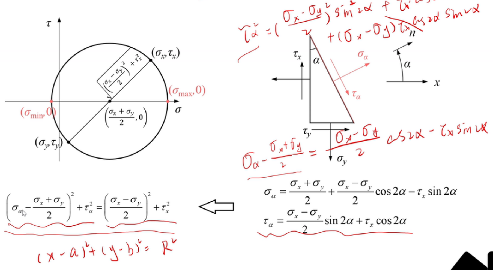 

##### 空间应力状态分析

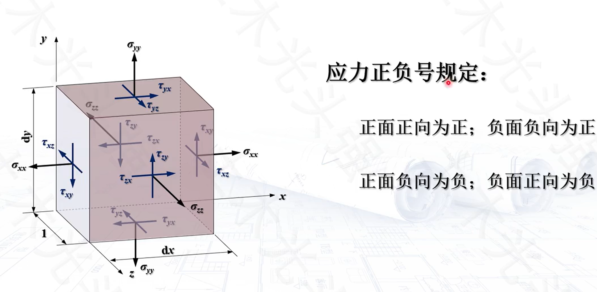

负面负向为正：例如左侧面导航的$\sigma_{xx}$，左侧面为负面，它指向x轴负向，所以它符号为负 

- 斜截面上的正应力与切应力：

  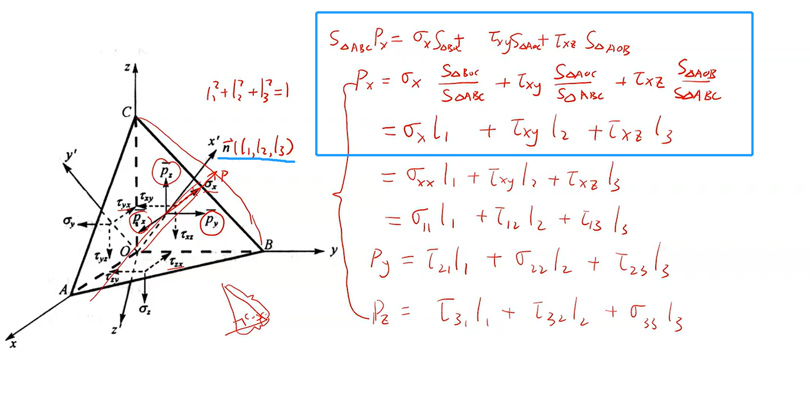

  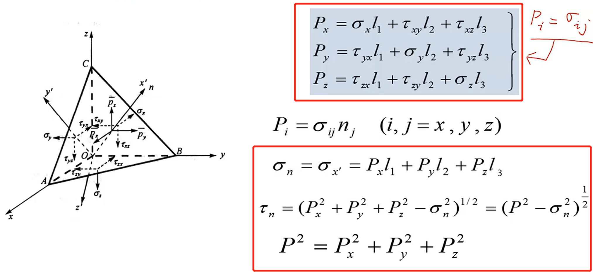

  \

- 空间应力圆：例如绕z轴旋转时影响的是$\sigma_{xx},\tau_{xy},\sigma_{yy},\tau_{yx}$,右边坐标轴的图也就是类似于平面应力圆，对应的力是上面这四个力

  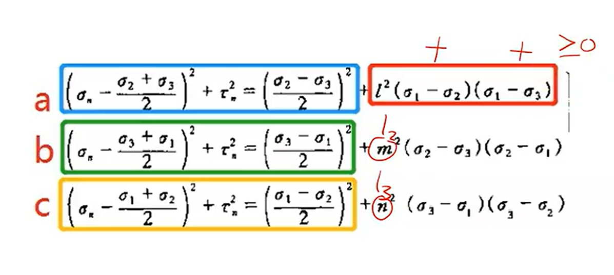

  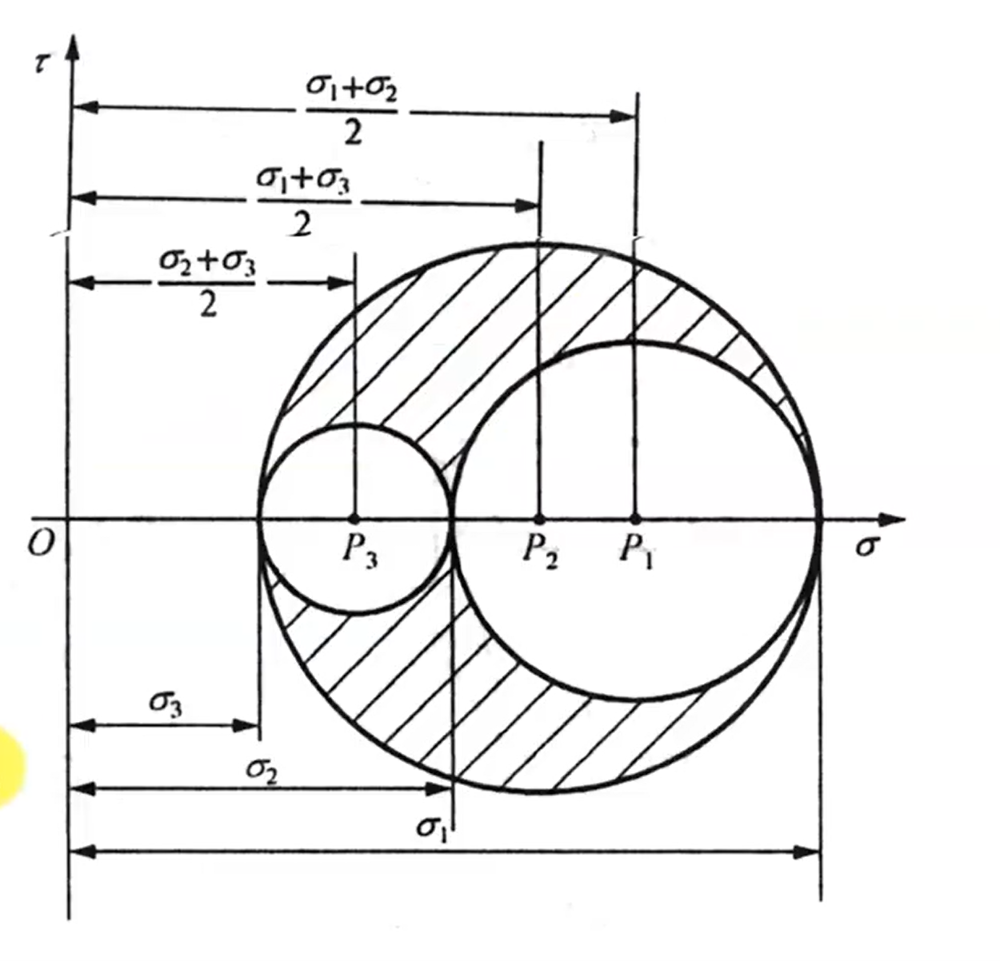

- 应力的张量表达：

  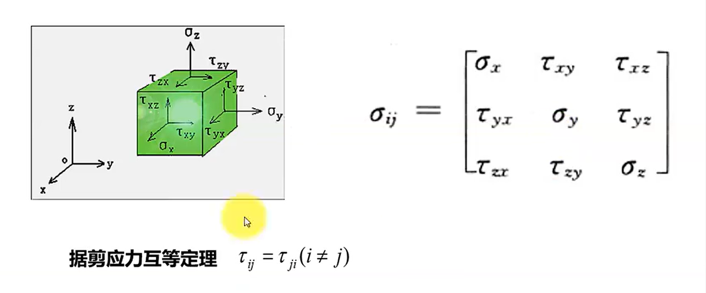

- 空间主应力：转到某个位置时，三个平面上的切应力都为0.按代数值大小排列为第一、第二、第三主应力

  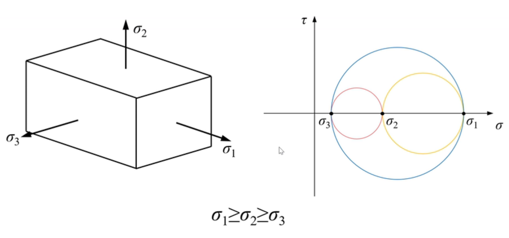

- 主应力与主方向：三个主应力为下列方程的三个解$\sigma_1,\sigma_2,\sigma_3$

  

#### 公式

##### 主应力（三角函数法）

$\left\{\begin{aligned}\sigma_1&=\frac{2}{\sqrt{3}}\sqrt{I_2'}cos(\omega_{\sigma}-\frac{\pi}{3})+\frac{1}{3}(\sigma_x+\sigma_y+\sigma_z)\\\sigma_2&=\frac{2}{\sqrt{3}}\sqrt{I_2'}cos(\omega_{\sigma}+\frac{\pi}{3})+\frac{1}{3}(\sigma_x+\sigma_y+\sigma_z)\\\sigma_3&=\frac{2}{\sqrt{3}}\sqrt{I_2'}cos\omega_{\sigma}+\frac{1}{3}(\sigma_x+\sigma_y+\sigma_z)\end{aligned}\right.$

其中，

球应力张量：$\sigma_m=\frac{1}{3}(\sigma_x+\sigma_y+\sigma_z)$(资料来源：[弹性力学有限元入门-应力、应变及张量 - 知乎](https://zhuanlan.zhihu.com/p/426460818))

$\begin{aligned}I_2'&=\sum\limits_{i\neq j}[-(\sigma_i-\sigma_m)(\sigma_j-\sigma_m)+\sigma_{ij}^2]\\I_3'&=|\sigma_{ij}'|,\ \ \ \ \ \ \ \ \sigma_{ij}'=\sigma_i-\sigma_m,i=j\\\omega_{\sigma}&=\frac{1}{3}cos^{-1}(-\frac{3\sqrt{3}}{2}\frac{I_3'}{I_2'^{\frac{3}{2}}})\end{aligned}$

##### 最大切应力：$\tau_{max}=\frac{\sigma_1-\sigma_3}{2}$

##### 等效应力：

$\begin{aligned}\overline\sigma&=\sqrt{3I_2}\\&=\sqrt{\frac{1}{2}[(\sigma_1-\sigma_2)^2+(\sigma_1-\sigma_3)^2+(\sigma_2-\sigma_3)^2]}\end{aligned}$

##### 分情况的主应力公式

[主应力及强度理论公式 | 常用力学公式 (mechtool.cn)](https://www.mechtool.cn/mechanicsformula/mechanicsformula_theoreticalformulaofprincipalstressandstrength.html)

#### 算例

##### 算例1

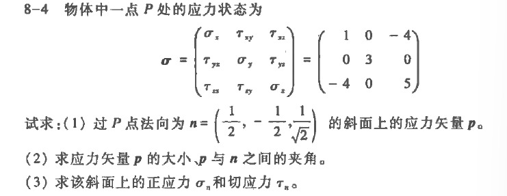

$\begin{aligned}I_1&=1+3+5=9\quad \\I_2&=3+5+15-0-16-0=7\quad \\I_3&=|\sigma|=15-0-48=-33\end{aligned}$

对应的应力方程为：$x^3-9x^2+7^x+33=0$

| 牛顿迭代 | x1=-1.47214  f=-7.10543e-15 | x2=3 f=0 | x3=7.47214 f=2.13163e-14 |
| -------- | :------------------------------- | ------------- | ----------------------------- |
|          |                                  |               |                               |

#### 解三次应力方程的方法

##### 利用三次方程的卡丹公式

- 缺点：在公式中有复数，无法用代码实现？
  - 已解决：可以排除有复数根的情况
  - 公式见文献

##### 盛金公式法

- 缺点：$\Delta>0$时，公式中也涉及复数，此时方程有一个实根和一对共轭复根（是否能排除这种情况？）

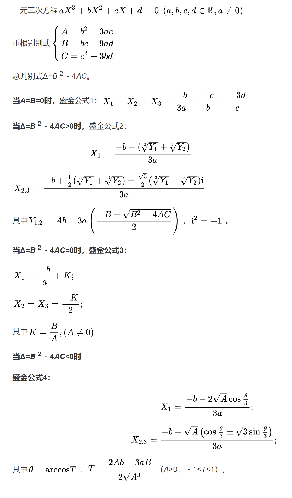

$a=1,b=-I_1,c=I_2,d=-I_3$

重根判别式：

$\begin{aligned}A&=I_1^2-3I_2\\B&=-I_1I_2+9I_3\\C&=I_2^2-3I_1I_3\end{aligned}$

$\Delta=B^2-4AC$

- $A=B=0时，x_1=x_2=x_3=3I_1$

- $\Delta>0,\begin{aligned}x_1&=\frac{I_1-(\sqrt[3]{Y_1}+\sqrt[3]{Y_2})}{3}\\x_{2,3}&=\frac{I_1+\frac{1}{2}(\sqrt[3]{Y_1}+\sqrt[3]{Y_2})\pm\frac{\sqrt{3}}{2}(\sqrt[3]{Y_1}-\sqrt[3]{Y_2})i}{3}\end{aligned}$

  其中$Y_{1,2}=-AI_1+3(\frac{-B\pm\sqrt{B^2-4AC}}{2})$

- $\Delta=0,\begin{aligned}x_1&=I_1\\x_2=x_3&=\frac{-K}{2}\end{aligned}$

  其中$K=\frac{B}{A}$

- $\Delta<0,\begin{aligned}x1&=\frac{I_1-2\sqrt{A}cos\frac{\theta}{3}}{3}\\x_{2,3}&=\frac{I_1+\sqrt{A}(cos\frac{\theta}{3}\pm\sqrt{3}sin\frac{\theta}{3})}{3}\end{aligned}$

  其中$\theta=arccosT,T=\frac{-2AI_1-3B}{2\sqrt{A^3}}$

##### （数值方法）牛顿迭代

参考资料：[数值计算方法](13024533_数值计算方法.pdfs)P98 3.3单个非线性方程的Newton法

需要考虑的几个问题：

- 对于不同的系数解的情况：一个，两个，三个或不存在
- 迭代是否收敛？有一定的判断方法，例如压缩映射一定有解，在应力方程中系数是已知且相互联系的，是否能推导出迭代的收敛性？
  - 牛顿法构造的迭代函数是压缩映射
- 初始值的选取，若选取不好则可能无法收敛到x*

当前代码的缺陷：

- 需要选取左右端点值，并不是严格意义上的全局解
- 用二分法的方法来判断某区间内是否存在解，需要将区间取得充分小

一个优化方法：可以通过导数为0求出两个极值点，确定一个零点的范围。但其他两个极值的范围还是需要确定左右端点

##### 利用Sturm定理确定根的区间

可结合牛顿迭代或求根公式

##### （数值方法）Jenkins-Traub

##### 结果比较

卡丹公式:0ms

盛金公式：4ms
